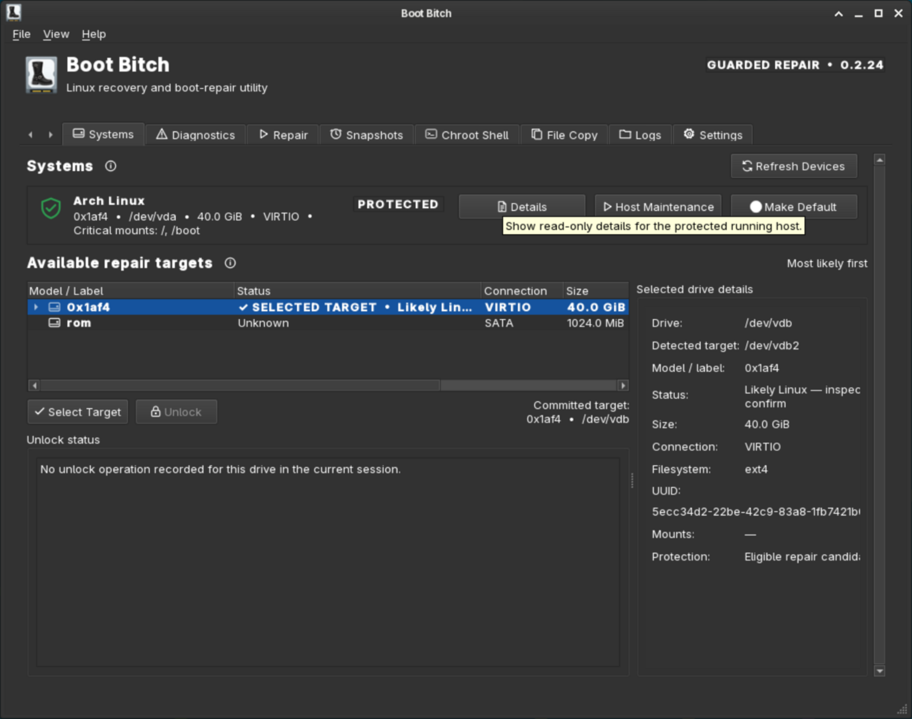
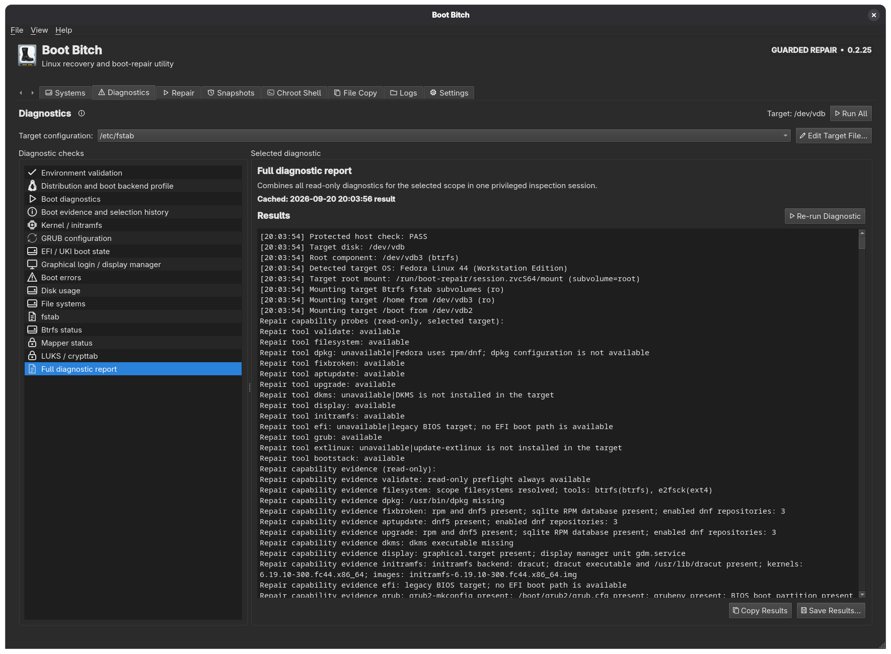
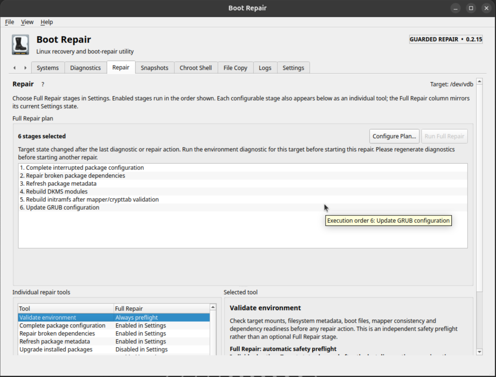
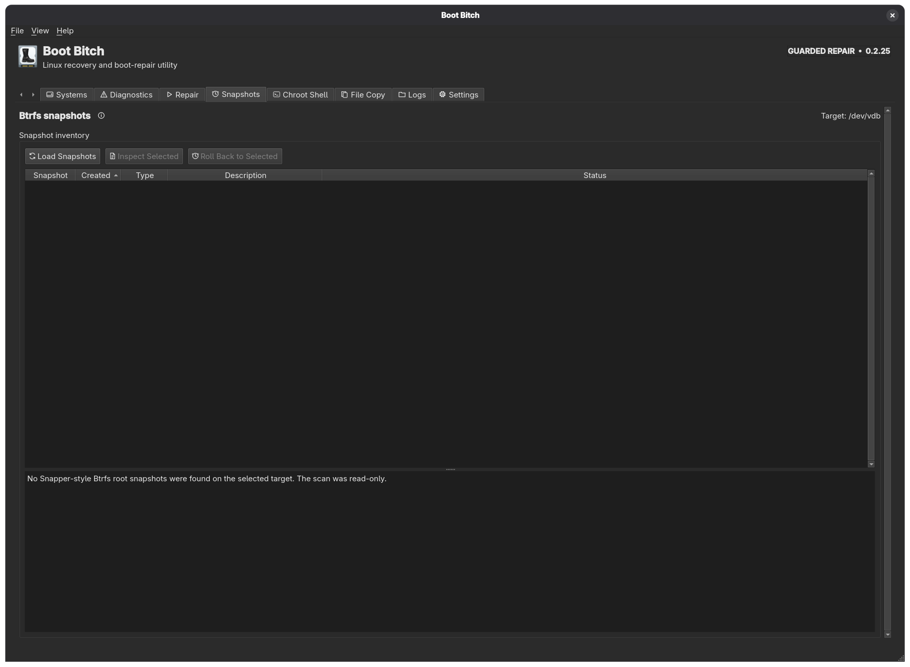
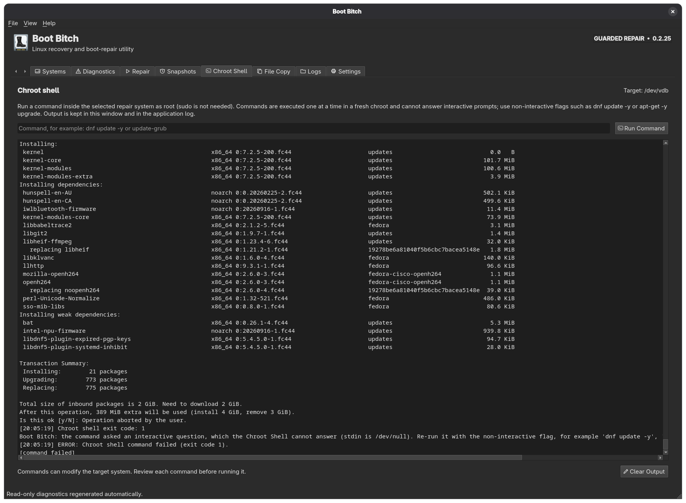
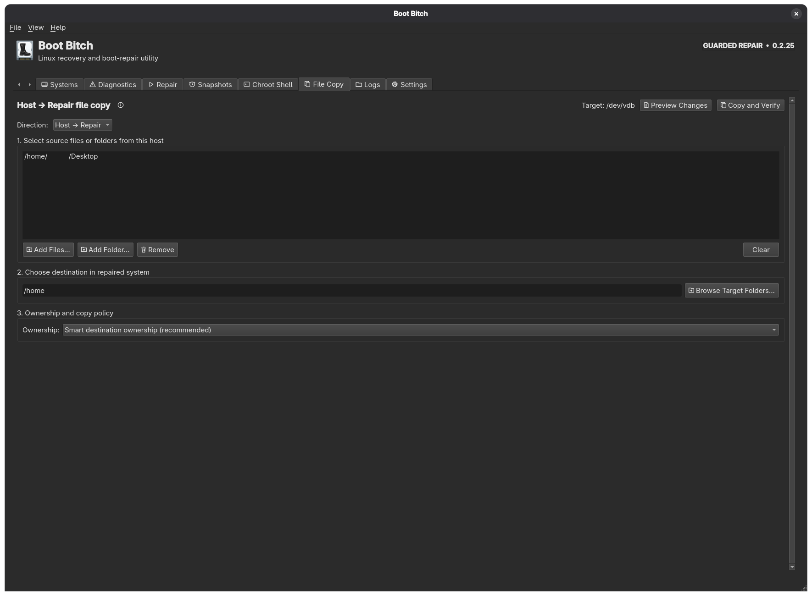
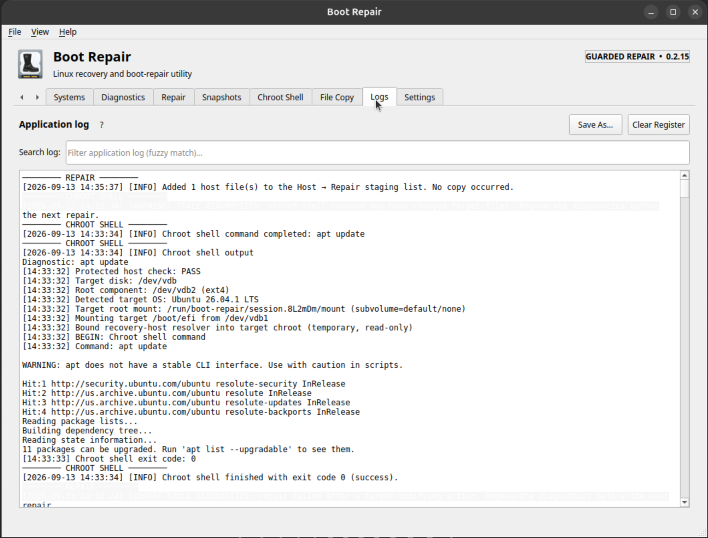
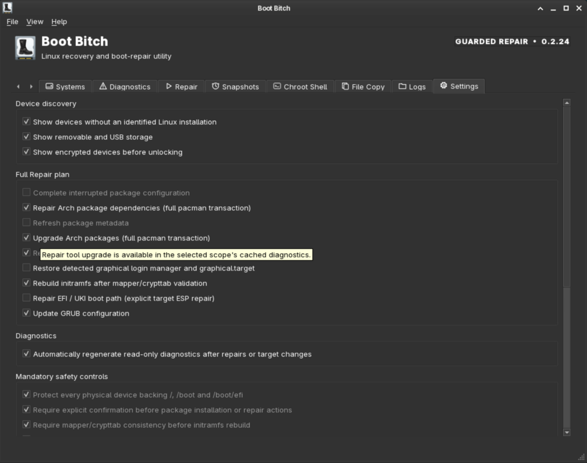

# Boot Bitch 0.2.20 — maintenance release

Boot Bitch is a native Qt 6 Linux recovery utility. The application command and Debian package retain the stable technical name `boot-repair` for compatibility; the source repository is `Boot_Bitch`. Version 0.2.20 retains the guarded diagnostics cache, simulation-first repair stack, Btrfs snapshot recovery, audited chroot shell, verified file copy, responsive Qt interface, and cross-desktop packaging prepared for public distribution. Each repair layer performs the strongest practical read-only or trial preflight available, applies only recognized deterministic corrections, and stops on unknown failures instead of guessing. The application was written to address the lack of coherent tooling that lets a non-developer restore a system so it can boot after something goes wrong. Common boot issues can be addressed directly, while the diagnostics, chroot shell and file-copy workflows also support troubleshooting and manual fixes.

This project was written with LLM assistance under human guidance, requirements and manually verified tests.

**Developer:** CaptainMorgan12

## Minimum recovery requirement

Boot Bitch must be launched from a **different booted Linux environment than the system being repaired**. Use a Linux live USB, recovery stick, or another Linux installation on a different physical drive. The running host is never a valid repair target.

## Safety boundary

This build can:

- enumerate and rank Linux storage devices with the existing read-only scanner;
- protect the top-level device backing `/`, `/boot` and `/boot/efi`;
- select a physical repair disk and its best visible Linux root component;
- unlock a selected non-host LUKS repair component through `cryptsetup` + Polkit without placing the passphrase in command arguments or logs;
- prefer the newly visible Linux filesystem inside an unlocked LUKS stack;
- mount the selected target in a private `/run/boot-repair` session;
- independently re-check that the selected target does not back the running host before any write;
- validate `/etc/os-release`, `/etc/fstab`, `/etc/crypttab`, boot files and target-family support;
- mount target `/boot` and `/boot/efi` entries when they are safely resolvable on the selected disk;
- bind the minimum runtime filesystems needed for a chroot repair;
- on Debian/Ubuntu/TUXEDO-family targets, run guarded package repair, DKMS rebuild, offline SDDM graphical-login recovery, initramfs rebuild, distribution-aware EFI/UKI recovery, boot-stack reconciliation, and `update-grub`;
- require an explicit confirmation in the GUI before every modifying operation;
- request administrator authorization once per Boot Bitch window and retain only the narrow whitelisted helper session until explicitly locked or the app exits;
- show modifying operations and Run All diagnostics in a modal privileged-output window, while individual diagnostics write directly into the persistent Results pane; persist the session log to `/var/log/boot-repair-session.log` only for requests that deliberately crossed the read-write boundary and still have a writable target log mount;
- copy files Host → Repair or Repair → Host with guarded `rsync -aHAX --numeric-ids`, smart ownership validation, no `--delete`, and post-copy verification;
- keep Repair → Host target mounts read-only and promote Host → Repair read-write only after the same independent target safety checks;
- perform a guarded transactional Btrfs `@` rollback after a read-only preflight, while keeping the source snapshot unchanged and retaining the previous root under a timestamped `@rollback-before-*` name;
- build a Release executable and Debian package with the privileged helper included.

Still intentionally constrained in 0.2.20:

- automatic/implicit EFI-loader reinstall: EFI repair remains an explicit action or opt-in Full Repair stage;
- transactional rollback is limited to Btrfs layouts with a normal top-level `@` root and Snapper-style root snapshots; it refuses unsupported layouts rather than guessing;
- modifying repair backends for non-Debian package families.


## Screenshots

These anonymized screenshots show Boot Bitch 0.2.15 running in an Ubuntu recovery VM. The target is a separate virtual disk; no personal host paths or physical-device identifiers are included.

### Systems



### Diagnostics



### Repair



### Snapshots



### Chroot Shell



### File Copy



### Logs



### Settings



## 0.2.20 refinements

- Keep snapshot and host-capability table rows compact under GNOME/GTK styles; only wrapped text receives additional height.
- Tint monochrome theme glyphs to the active readable text color in dark palettes while preserving colored status artwork.
- Update GitHub Actions checkout to the Node.js 24-compatible `actions/checkout@v5`.
- Add native Qt fallback glyphs and bundled icon search paths so AppImage controls
  remain visible when the host desktop theme is unavailable.

## 0.2.17 refinements

- Add optional Debian package suggestions for the Qt GTK platform theme, XDG desktop portal integration, and the dedicated GNOME Qt platform theme. KDE installations continue using their native Plasma style.
- Document GNOME launch options (`QT_QPA_PLATFORMTHEME=gtk3` or `gnome`) and keep theme selection environment-driven so dark/light settings and accessibility preferences come from the desktop.

## 0.2.16 refinements

- Fix Qt 6.4/Ubuntu CI compatibility for compact single-line snapshot rows.
- Install `pkexec` in the GitHub Actions runner so repair-readiness UI tests exercise the same guarded capability path as supported desktop systems.
- Accept a readable uploaded shell helper when a web-based copy loses its executable bit, invoking it explicitly through `/bin/bash`.

## 0.2.15 refinements

- Add the **Chroot Shell** page for one reviewed command at a time inside a fresh target chroot. The selected root, Btrfs subvolumes, `/boot`, `/boot/efi`, device access and temporary resolver are prepared by the guarded helper; output is shown in the page and Logs.
- Load Btrfs snapshots asynchronously when the application starts so they are ready when the Snapshots page is opened. Unsupported filesystems report a clear read-only explanation.
- Mark diagnostic evidence stale after target edits, repairs, snapshot rollback, Host → Repair copy, or shell commands that may have changed files. Failed commands with no reported target change do not invalidate evidence.
- Keep the newest application, diagnostic, repair, shell, unlock, snapshot and file-copy entries first, with visual section separators and stale target blocks.
- Add responsive tab navigation, stable scrollbar gutters, content-sized table rows, adjustable Repair splitters and theme-neutral log highlighting for KDE and GNOME.
- Add anonymized Ubuntu VM screenshots and a disposable VM testing guide.

## 0.2.14 refinements

- Added persistent categorized repair transcripts, section separators and stale diagnostic highlighting in Logs.
- Loaded Btrfs snapshots asynchronously and kept unsupported filesystems read-only with a clear explanation.
- Added compact responsive layouts, tab navigation controls, stable scrollbar gutters and adjustable Repair splitters.
- Added temporary recovery-host resolver support for chroot networking and improved APT refresh/error handling.
- These refinements were validated during development and are included in the 0.2.15 public release.

## 0.2.13 refinements

- Extend the adaptive repair policy beyond APT: DKMS, graphical login/SDDM, initramfs, EFI/UKI, GRUB and Boot stack reconciliation now run a simulation or read-only/trial preflight before their modifying command.
- DKMS inspects registered modules and installed-kernel header/build readiness first. When a matching `linux-headers-<kernel>` package is available, Boot Bitch simulates the package correction under the same protected-removal policy, installs it only if safe, then runs `dkms autoinstall` and verifies status. A recognized missing-header failure is corrected/retried once.
- SDDM recovery preflights `sddm`, `graphical.target`, the service unit and (on TUXEDO) the desktop meta-package. Missing/reinstall package corrections are APT-simulated and safety-checked before execution; the graphical session is still never started inside the repair chroot.
- Initramfs repair trial-builds every installed kernel with `mkinitramfs` into temporary `/run/boot-repair` session output before touching `/boot`. It validates crypttab/mapper state, creates a missing initrd instead of blindly updating it, verifies the resulting archive, and can restore a recognized stale recovery-mapper compatibility alias before one retry.
- TUXEDO UKI repair validates the ESP, newest kernel/modules, matching initramfs and free ESP working space before calling the vendor builder. A missing newest-kernel initramfs is repaired first. Conventional GRUB EFI repair preflights its exact target/id/mode and retries once with `--no-nvram` only for recognized firmware-variable/NVRAM failures.
- GRUB repair first generates a complete `grub-mkconfig` candidate into temporary session output, keeps stderr separate from the candidate, syntax-checks with `grub-script-check` when available, and only then runs `update-grub`. A recognized stale mapper/canonical-path failure is corrected and retried once.
- Boot stack reconciliation composes those same adaptive component workflows in order; it no longer hides initramfs/UKI/GRUB failures behind one compound command.
- Unknown DKMS/build, initramfs, EFI/UKI or GRUB failures remain hard stops. Boot Bitch does not auto-delete kernels, snapshots, EFI entries or arbitrary configuration in response to an unrecognized error.

## 0.2.12 refinements

- Individual target diagnostics write their output directly to the persistent Results pane; no redundant modal progress/output dialog is shown for a single diagnostic.
- **Run All** retains the consolidated privileged progress/output dialog and still populates the per-diagnostic cache.
- The Individual repair tools list now mirrors every Settings-controlled Full Repair stage one-for-one: dpkg configuration, broken dependencies, APT metadata refresh, adaptive package upgrade, DKMS, SDDM, initramfs, EFI/UKI, and GRUB.
- The Full Repair column explicitly reports whether each matching stage is enabled or disabled in Settings. Validate environment remains an automatic safety preflight; Boot stack reconciliation remains a manual recovery tool.
- Individual package-maintenance tools now invoke exactly the same helper stages used by Full Repair, avoiding UI/backend drift.

## 0.2.11 refinements

- Add the Boot Bitch boot-on-drive artwork as the real application icon. The source contains a 1024px RGBA master, the Qt executable embeds a resource fallback for build-tree execution, and Debian installs Freedesktop/KDE `hicolor` PNGs at 16, 22, 24, 32, 48, 64, 128, 256, 512 and 1024 pixels.
- Change the desktop entry to `Icon=org.bootrepair.BootRepair` and use the same icon for the Qt window/header instead of the generic `drive-harddisk` application icon. Device rows continue using storage/security theme icons because those communicate device state rather than application identity.
- Replace the hard-coded `apt-get -y upgrade` repair step with an adaptive simulation-first upgrade. Boot Bitch first simulates ordinary `upgrade`; when the target distribution explicitly rejects it or packages remain pending, it evaluates `full-upgrade`, with `dist-upgrade` as the compatible fallback.
- Refuse simulated transactions that remove essential packages, protected TUXEDO/desktop/kernel/boot packages, or more than 20 packages. The selected upgrade mode and complete simulation output are written to the repair session log before the actual command runs.
- Run a non-destructive `dpkg --audit` after a successful upgrade.
- Extend staged-install and `.deb` validation to verify the packaged hicolor icons and desktop icon name.

## 0.2.10 refinements

- Keep rollback planning, diagnostics, validation, snapshot inventory/inspection and File Copy preview strictly read-only all the way through helper cleanup; they no longer attempt to append the helper session log to a read-only target `/var/log`.
- Track the exact point a helper request crosses the read-write boundary. Target-side session-log persistence is permitted only after that point and only while `/var/log` is actually mounted read-write.
- Remove GNU awk warnings from snapshot OS-name parsing by using portable quote matching in the rollback inventory/preflight code.
- Retain the hardware-validated 0.2.9 rollback plan and all 0.2.8 unlock/session, diagnostics, snapshot inventory and verified File Copy behavior.

## 0.2.9 refinements

- **Transactional Btrfs snapshot rollback is enabled.** Selecting **Roll Back to Selected** first runs a privileged read-only rollback plan. The GUI shows that plan, requires a second warning confirmation, and requires typing `ROLLBACK` exactly before any Btrfs root switch occurs.
- The source snapshot is never renamed, modified or deleted. Boot Bitch creates a **writable Btrfs snapshot copy**, preserves the existing top-level `@` as `@rollback-before-<timestamp>`, promotes the writable candidate to `@`, and sets that new `@` as the Btrfs default subvolume so the next ordinary boot no longer depends on the snapshot menu.
- Separate Btrfs subvolumes listed by the selected snapshot's `fstab` (for example `/home`, `/root`, `/var/log`, swap and snapshot storage) remain outside the root rollback and are remounted from their real target subvolumes for post-switch validation.
- Post-switch reconciliation validates `fstab`/`crypttab`, kernel-to-modules state and dpkg consistency, rebuilds all target initramfs images, rebuilds the TUXEDO UKI through `create_boot_uki_base.sh` when present, verifies the rebuilt UKI root/LUKS/Btrfs-`@` command-line binding, regenerates GRUB, and verifies that the promoted root is actually mounted from `@`.
- The TUXEDO UKI path continues to preserve the target ESP's existing firmware `BootOrder`/`BootNext` relationship and does not remove or reorder entries belonging to other physical disks.
- **Automatic root restoration:** if critical post-switch validation, initramfs, UKI or GRUB reconciliation fails, Boot Bitch unmounts the failed candidate, restores the preserved old root to `@`, restores the previous Btrfs default subvolume, and reconciles the original root's boot stack. The failed candidate is retained as `@rollback-failed-<timestamp>` for investigation rather than deleted.
- A successful rollback retains the previous root as `@rollback-before-<timestamp>` for manual recovery. The snapshot inventory and cached target diagnostics are invalidated because the active normal root changed.
- Rollback refuses a target with no normal top-level `@`, a snapshot missing Linux root metadata, or less than 1 GiB of Btrfs free working space. Read-only **Inspect Selected** and **Load Snapshots** remain available independently of rollback.

## 0.2.8 refinements

- **Committed target is now visually persistent.** Clicking rows continues to change only the inspection selection, while pressing **Select Target** marks that physical drive with a persistent `✓ SELECTED TARGET` status, a subtle full-row target tint, and a separate **Committed target:** label beside the Systems actions. The marker survives clicking/inspecting other drives and is rebuilt after device refreshes.
- The committed physical target remains the target for Repair, Diagnostics, Snapshots and File Copy until another physical drive is explicitly committed with **Select Target**. This separates transient row focus from destructive-operation intent.
- The LUKS passphrase dialog is narrower and purpose-built instead of using the oversized static text-input dialog. The secret remains password-masked and is still sent only over the privileged helper pipe.
- A cryptsetup **bad-passphrase** result is now distinguished from other unlock failures. Boot Bitch offers **Retry** and asks only for the LUKS passphrase again; the already-authorized administrator helper session remains active, so Polkit is not repeated.
- Every privileged target request continues to unmount only the temporary repair mounts it created before returning. Ending **File → Lock Administrator Session** or closing Boot Bitch then closes only LUKS mappings opened by Boot Bitch itself; pre-existing/external mappings are never closed.
- Administrator-session shutdown now allows more time for owned mount/mapper cleanup before escalating from graceful QUIT to termination. Locking the session refreshes device topology afterward so a successfully closed Boot Bitch-owned mapper immediately appears locked in Systems.

## 0.2.7 refinements

- **Fix retained administrator-session exit code 126.** The broker still copies the authenticated helper to a root-owned runtime file, but child operations are now invoked explicitly through `bash`. This works when `/run` is mounted `noexec` while retaining the protection against re-executing a user-writable source-tree helper after authorization. Diagnostics, File Copy, validation and repair therefore reuse the authorized session instead of all failing with exit code 126.
- **Snapshots are now loaded through the guarded helper, not the desktop user's mount permissions.** The Snapshots tab can enumerate Snapper-style `@.snapshots/<id>/snapshot` or `.snapshots/<id>/snapshot` trees through a temporary read-only Btrfs top-level mount. This avoids permission failures on root-owned snapshot metadata.
- **Inspect Selected** performs a second read-only helper request for the chosen snapshot and reports Btrfs metadata, Snapper type/description, `/etc/os-release`, `fstab`, `crypttab` and visible kernel/initramfs files. No snapshot/subvolume/boot state is modified.
- Snapshot rows retain the relative Btrfs path internally and show creation/type/description/status in the table. The snapshot inventory is cleared when the selected target identity changes.
- Failed **Run All** diagnostics are no longer logged as if successful results had been generated/cached.
- Existing-mapper handling remains unchanged: a pre-opened LUKS mapping is shown as **Already Unlocked** and is never closed by Boot Bitch.
- In 0.2.7, transactional Btrfs rollback was deliberately still disabled while privileged snapshot inventory/inspection was being hardware-validated.

## 0.2.6 refinements

- **Unlock state is explicit.** A locked LUKS child can be unlocked even when another mapped filesystem exists on the same physical drive; an already-open mapping now shows **Already Unlocked** instead of looking like a broken disabled Unlock button. Encrypted child rows report **LUKS unlocked — mapped Linux filesystem visible** when `lsblk` exposes their mapped child.
- New mappings use the conventional **`luks-<UUID>`** name rather than a `boot-repair-*` name. If another recovery tool already opened the same LUKS device under a different mapper name, Boot Bitch reuses it and never closes/reopens it blindly.
- A LUKS mapping created by Boot Bitch stays open while the authorized app session is active so later diagnostics/repairs can reuse it. **Lock Administrator Session** or exiting Boot Bitch closes only mappings opened by Boot Bitch; mappings that were already open before Boot Bitch attached to them are left untouched.
- Every privileged target operation now avoids propagating a foreign recovery-only mapper name into chroot mount metadata. Boot Bitch prefers an existing `luks-*` alias; otherwise it mounts through the canonical `/dev/dm-N` node, reads the target `crypttab`, and creates a **temporary `/dev/mapper/<expected>` compatibility symlink** when the installed system expects another name. The alias is removed on cleanup. This prevents `grub-probe`, `cryptsetup-initramfs`, package postinst hooks and initramfs rebuilds from failing on a stale recovery-only mapper path.
- Adds **Graphical login / SDDM** to Diagnostics. It reports the target default systemd target, `display-manager.service`, SDDM/Plasma package state, the SDDM unit file, persistent SDDM journal output, and recent graphics/NVIDIA/DRM-related target log lines.
- Adds **Restore SDDM graphical login** as an individual repair tool and opt-in Full Repair stage. It works offline: verifies SDDM is installed, sets `graphical.target` as the target default, enables SDDM, repairs `display-manager.service`, verifies both symlinks, and deliberately **does not start SDDM inside the repair chroot**.
- Adds **EFI / UKI boot state** Diagnostics. On a selected target it inventories only that target ESP, decodes a visible TUXEDO `TUX.EFI` `.uname`/`.cmdline` when `objcopy` is available, checks that the embedded kernel exists under target `/boot`, and filters firmware entries by the selected ESP PARTUUID so unrelated disks are not treated as repair targets.
- EFI repair is now **distribution-aware**. When a TUXEDO target provides `/usr/sbin/create_boot_uki_base.sh`, Boot Bitch uses that vendor builder instead of blindly running `grub-install`. Before the build it records the existing `TUXEDO UKI` entry, `BootOrder`, and `BootNext` for the selected ESP; after the builder recreates the entry it substitutes only the recreated ID back into the old order and leaves entries for other disks untouched. Conventional GRUB EFI targets retain the guarded `grub-install` path.
- Adds manual **Boot stack reconciliation** for a partial update or snapshot/root rollback mismatch. It validates mapper/crypttab, rebuilds all target initramfs images, rebuilds the TUXEDO UKI when the target supplies the official builder, verifies the embedded UKI kernel when possible, and regenerates the GRUB fallback. It does **not** remove kernels, snapshots, EFI entries, or unrelated-drive boot records.
- Host Capabilities now includes offline `systemctl`, `efibootmgr`, and `objcopy` support. The one-command dependency setup installs `efibootmgr` and `binutils` as well.
- In 0.2.6, Btrfs snapshot rollback was still disabled while the mapper/chroot and boot-stack reconciliation primitives were being validated; 0.2.9 builds the transactional rollback path on those primitives.

## 0.2.5 refinements

- The first privileged operation opens one **administrator helper session** through Polkit. Subsequent privileged actions in the same Boot Bitch window reuse that session, so selecting another target diagnostic, validating, copying files, or running a repair does not repeatedly ask for the administrator password.
- The main Qt GUI still runs as the normal desktop user. The privileged process exposes only the existing whitelisted helper commands; it is not a root shell and does not accept arbitrary commands.
- **File → Lock Administrator Session** explicitly closes the privileged helper. Closing Boot Bitch also closes it. The next privileged action then requests authorization again.
- For source-tree testing, the broker copies the authenticated helper to a root-owned mode-0700 runtime file before serving requests. This prevents a user-writable development helper from being modified and re-executed as root after the one-time authorization.
- Diagnostic results are cached **per diagnostic**, not merely in the currently visible result pane. Switching among Environment, Boot, Kernel/initramfs, GRUB, Errors, Usage, fstab, Btrfs, Mapper, LUKS and Full report preserves each result until it is explicitly re-run or invalidated.
- Cached diagnostics display their **capture date/time**. Target cache identity uses the physical repair disk plus the visible root filesystem UUID when available, so harmless `/dev/mapper/name` versus `/dev/dm-N` alias changes do not discard results.
- **Run All** uses one read-only privileged request, fills every individual diagnostic cache, and then displays the cached **Full diagnostic report**. Browsing any individual result afterward does not re-run it or re-authorize.
- A successful target write still invalidates target diagnostics. Changing to a different target/root also invalidates them. Read-only validation does not.
- An already-open mapper created by another recovery tool is intentionally treated as **already unlocked**. In that state the Unlock button is disabled because Boot Bitch must not blindly close/reopen a mapper it did not create.
- Host Capabilities row height is recalculated from the current column widths: rows collapse to one line when the text fits and expand only when text actually wraps.

## 0.2.4 refinements

- **Run All Available** now caches each repair-target diagnostic result in the GUI. Selecting Environment, Boot, Kernel/initramfs, GRUB, Errors, Usage, fstab, Btrfs, Mapper, or LUKS after Run All displays the stored result immediately instead of invoking Polkit again.
- An individual cached diagnostic is labeled **Re-run Diagnostic**; it authorizes again only when fresh target data is explicitly requested. Changing the selected target/root component or successfully modifying the target invalidates the target cache.
- Adds **EFI bootloader** as a separate repair tool and optional Full Repair stage. It is off by default in Settings so EFI writes never appear implicitly in the repair plan.
- Before EFI repair the helper validates `/boot/efi` **while the target is still read-only**, confirms it is mounted from the selected physical repair disk and is a FAT filesystem, and only then allows read-write promotion. It re-checks the same conditions immediately before writing, derives or reuses the target EFI vendor/bootloader ID, and runs target `grub-install --target=x86_64-efi --efi-directory=/boot/efi --recheck`.
- When writable UEFI efivars are available, `grub-install` may update the firmware NVRAM entry. When efivars are unavailable/read-only, Boot Bitch uses `--no-nvram`, repairs the ESP files only, and reports that firmware registration was skipped.
- The helper verifies that a GRUB/shim EFI binary exists under the resulting `/boot/efi/EFI/<bootloader-id>/` directory. An individual EFI repair also regenerates GRUB configuration afterward.
- EFI reinstall never uses `grub-install --force`; an unsafe/unsupported ESP or target layout is refused instead of being forced.
- Host capability table rows now compute their height from the **current** column widths: ordinary rows collapse to one line and only genuinely wrapped Feature/Notes content expands vertically.

## 0.2.3 refinements

- Fixes the shared safety check that previously rejected an unlocked `/dev/mapper/boot-repair-*` Btrfs root as not belonging to its selected physical disk. The helper now uses `lsblk --inverse` to trace dm-crypt/LVM-style dependency stacks to their physical disk and retains a conservative sysfs fallback. Multi-disk stacks are still refused.
- Partition, LUKS, mapper and filesystem child rows in **Systems** are selectable for inspection. **Select Target** still resolves to the parent physical disk and preferred Linux root, so detail selection cannot bypass the physical-target boundary.
- When an unlocked Linux-capable child is visible beneath LUKS, the top-level status now says **Unlocked Linux filesystem — inspect to confirm** instead of continuing to look locked.
- Repair-target Diagnostics now call the privileged helper, mount the selected target and safely resolvable `/boot`/`/boot/efi` entries **read-only**, inspect the target, then unmount on helper exit.
- Target diagnostics now report real target OS identity, root subvolume, boot contents/mounts, kernel/initramfs pairing, GRUB configuration, persistent journal errors, free-space usage, `fstab`, Btrfs subvolumes, mapper status and `crypttab`/mapper references.
- **Run All Available** uses one read-only privileged helper invocation for the entire target report, avoiding one authorization prompt per diagnostic item.
- Running-host diagnostics remain unprivileged and unchanged. The repair helper still requires a separate authorization when a later modifying repair or Host → Repair copy is started.

## 0.2.2 refinements

- Enables **Preview Changes** and **Copy and Verify** for both Host → Repair and Repair → Host.
- Uses `rsync -aHAX --numeric-ids` and never adds `--delete`; unrelated destination files remain in place.
- Smart ownership compares the source numeric UID/GID identity names across the host and repaired system. If the same numeric IDs mean different users/groups, the copied item is assigned to the destination-directory owner instead of silently preserving the wrong account.
- Explicit **Preserve source numeric UID/GID** remains available for advanced recovery work.
- Host → Repair validates target containment, rejects path traversal/symlink escapes, performs a read-only target preflight, and only then remounts the selected target filesystem read-write.
- Sensitive target paths such as `/etc`, `/boot`, `/usr`, `/root` and `/var` require the GUI's extra confirmation token before the helper will write them.
- Repair → Host keeps the repaired filesystem read-only and refuses system-critical host destinations. Normal recovery destinations under `/home`, `/mnt`, `/media`, `/run/media`, `/tmp`, or a separate non-system mount are accepted.
- After each real copy, the helper performs a second checksum/metadata rsync dry-run and SHA-256 verification of regular files.
- Target destination directories may be created safely; newly created directories inherit the nearest existing target directory's numeric owner.
- Retains the Systems-tab **Unlock** button and correct **Bidirectional file copy** capability name.
- Expands `check-dev-env.sh` to verify the runtime tools needed for unlock, mounting, verified copy and guarded target work, while `setup-dev-deps.sh` installs them in one pass on Debian/Ubuntu/TUXEDO-family development hosts.

## 0.2.1 refinements

- Adds an **Unlock** button beside **Select Target** for locked LUKS repair candidates.
- Sends the LUKS passphrase to the privileged helper only through standard input; it is not put in argv or the application/helper logs.
- Uses deterministic `boot-repair-*` mapper names and refuses collisions rather than replacing an existing mapping.
- Refreshes the storage topology after unlock so the mapped ext4/Btrfs/Linux filesystem becomes the preferred repair component and can subsequently be repaired read-write through the existing guarded helper.
- Changes File Copy from a one-way Host → Repair concept to an explicit **Host → Repair / Repair → Host** direction selector. Changing direction clears staged paths so host and repair namespaces cannot be mixed accidentally.
- Adds host destination browsing for Repair → Host and safe absolute repair-path staging for the repair side. Version 0.2.2 completes the guarded execution/verification backend.
- Renames the rsync capability to **Bidirectional file copy** to avoid the mangled one-way feature label.
- Cleans Debian package metadata by removing the redundant explicit `util-linux` dependency, adding the runtime `cryptsetup` dependency for Unlock, and emitting the extended description as one properly wrapped value.

## 0.2.0 refinements

- Adds `scripts/boot-repair-helper.sh`, a whitelisted privileged backend used through `pkexec` when the GUI is not already root.
- Repeats host-protection checks inside the privileged helper rather than trusting only GUI state.
- Rejects root components that do not resolve exclusively to the selected physical disk.
- Mounts repairs in an isolated `/run/boot-repair/session.*` tree and unmounts in reverse order on exit.
- Adds guarded individual Package, DKMS, Initramfs and GRUB actions plus the configured Full Repair sequence.
- Keeps `apt upgrade` opt-in; it runs only when the existing Settings checkbox is explicitly enabled.
- Improves unlocked-LUKS target selection by preferring a visible Linux filesystem over the still-visible crypto container.
- Adds `scripts/check-dev-env.sh` and `scripts/setup-dev-deps.sh` for one-command Debian/Ubuntu/TUXEDO development setup and validation.
- Includes the privileged helper in the staged install and `.deb` validation workflow.

## 0.1.10 refinements

- Cleans the remaining Debian package QA warnings from the 0.1.9 validation pass.
- Uses a correctly named Debian changelog entry (`boot-repair (...)`) for `changelog.gz`.
- Wraps the Debian extended package description at conventional line lengths.
- Retains the one-command Release executable + `.deb` build in `scripts/build.sh`.
- Retains `install.sh --dry-run` for installation simulation and explicit `INSTALL` confirmation for future real installation.

## 0.1.9 refinements

- Licensed under the MIT License; see `LICENSE`.
- Adds `scripts/build.sh` for one-command Release executable + `.deb` generation without installing anything.
- Debian package now installs MIT copyright/license metadata, compressed changelog and a `boot-repair(1)` man page.
- Debian package Release binary is stripped during packaging.
- Desktop entry uses a single main category to avoid duplicate-menu hints.
- Removes the unnecessary explicit dependency on Debian's Essential `util-linux` package while runtime capability checks remain in the application.
- Package description and maintainer metadata are lint-friendly.
- `test-deb.sh` suppresses the harmless `/var/log/dpkg.log` dry-run permission warning.
- `install.sh` installs the generated `.deb` only after explicit `INSTALL` confirmation and supports `--dry-run`.
- `uninstall.sh` prefers package-manager removal for a `.deb` installation and retains a CMake-manifest fallback.

## 0.1.8 refinements

- Repair, Snapshots and File Copy target summaries now prefer a single line when space allows, but wrap cleanly at narrow widths instead of competing with headings.
- Target summary styling is consistent across those workflow pages.
- Debian package directory permissions are normalized to conventional 0755 regardless of the builder's umask.
- The `.deb` build/simulation workflow from 0.1.7 is retained unchanged.

- Removes the developer-only **Preview Unlock Dialog** control; the real LUKS dialog will return with the privileged read-only backend.
- Keeps compact page target labels to the selected physical drive; automatically resolved partition/component details remain available in tooltips and device details.
- Adds native CPack Debian packaging with automatic shared-library dependency discovery.
- Adds `scripts/package-deb.sh` to build, stage-check and create a `.deb` without installing it.
- Adds `scripts/test-deb.sh` to inspect, extract, dependency-simulate and optionally lint the `.deb` without installing it.
- Adds a dedicated **Diagnostics** tab with vertical diagnostic navigation, running-host/repair-target scope selection, selectable results, Copy Results, Save Results and Run All Available.
- Diagnostics are always visible; Settings never hides troubleshooting tools. Availability is determined only by the selected system and visible capabilities.
- Adds read-only summaries for environment, boot, kernel/initramfs, GRUB, boot-error capability, disk usage, fstab, Btrfs, mapper/LUKS and combined-report views.
- Adds concise contextual **?** help to the major workflow pages while removing redundant explanatory prose.
- Adds **Help → Using Boot Bitch** with the minimum requirement to boot from a live/recovery system or another Linux installation on a different drive.
- Snapshot controls now reflow vertically on narrow windows and the page scrolls before controls can overlap the snapshot table.
- Selected-tool status text shares the same left edge as its title/description instead of using an inset status frame.
- Host capability identity fields use consistent non-wrapping form rows and spacing.
- The protected running-host summary is more compact and keeps drive/model/size/connection/mount information on one summary line when space allows.
- The Systems target-selection disclosure was removed because contextual help now carries that explanation.
- Tab labels shorten at narrow window widths instead of exposing ambiguous tab overflow artifacts.
- Informational labels and diagnostic/table contents remain selectable/copyable.
- Existing stable scrollbar gutters, wrapped logs, dynamic candidate sizing and responsive Systems/Repair layouts remain.
- No privileged or storage-changing functionality is enabled.

## Development summary

The 0.1–0.2 development series established the recovery foundation, target safety boundary, diagnostics cache, simulation-first repair stack, encrypted-volume handling, Btrfs rollback, graphical-login recovery, Chroot Shell, verified File Copy, responsive interface and Debian packaging. The consolidated historical summary is in [docs/development-summary.md](docs/development-summary.md); the full version-by-version record remains in [CHANGELOG.md](CHANGELOG.md).

For recursive GitHub upload instructions, see [docs/publishing.md](docs/publishing.md).

## Source tree

```text
Boot_Bitch/
├── CMakeLists.txt
├── README.md
├── LICENSE
├── CHANGELOG.md
├── .gitignore
├── .github/workflows/ci.yml
├── data/                   desktop entry, AppStream metadata, man page
├── docs/                   testing guide, publishing guide, summary and screenshots
├── resources/              Qt resources and icons
├── scripts/                helper, build, packaging and validation tools
├── src/                    Qt application and target workflow
└── tests/                  UI and contract tests
```

Generated build output belongs in `build/` and is ignored by Git.

## Design goals

- Native Qt 6 Widgets application with standard resizable window controls.
- Follow the active Qt/KDE/desktop theme; no hard-coded light/dark stylesheet.
- Keep the source tree and dependency set small.
- KDE Frameworks 6 KAuth remains optional; guarded builds use a separate root helper launched through Polkit/pkexec.
- Privileged work is isolated from the normal GUI process and exposes only whitelisted operations.
- Missing optional runtime tools disable only the related feature.
- Never silently install host packages; target package changes require explicit repair confirmation.
- Storage discovery must not assume NVMe, internal disks, encryption or one filesystem layout.
- Current-system protection is mandatory and cannot be disabled.

### GNOME and KDE/Qt desktop integration

Boot Bitch is a Qt 6 Widgets application and deliberately does not force a
global stylesheet or the Fusion style. It follows the desktop's font, palette,
spacing, icons, dialogs and accessibility settings. KDE uses its normal Qt
platform theme. On GNOME, install the optional Qt platform-theme and portal
plugins for GTK-like controls and native file dialogs:

```bash
sudo apt install qt6-gtk-platformtheme qt6-xdgdesktopportal-platformtheme
```

`qgnomeplatform-qt6` is another optional GNOME theme implementation when your
distribution provides it. With that package installed, an explicit
`QT_QPA_PLATFORMTHEME=gnome` launch selects it; otherwise leave the variable
unset and Qt will use the available desktop platform theme. The GTK plugin can
also be selected explicitly with `QT_QPA_PLATFORMTHEME=gtk3 boot-repair`.
These packages only affect presentation. They do not change Boot Bitch's
privilege boundary or repair logic, and the Debian package lists them as
optional suggestions so minimal KDE, GNOME and headless installations remain
supported.

To compare available diagnostic and tab icons on the current desktop theme,
run `./scripts/check-icon-theme.sh`. It reports missing names and suggests
equivalent freedesktop icons without changing the active theme.

## Build dependencies

Required:

- C++17 compiler (GCC or Clang)
- CMake 3.20+
- Ninja
- Qt 6 Core/Gui/Widgets development files

Runtime/packaging support used by guarded repair builds:

- Polkit / `pkexec`
- util-linux (`lsblk`, `findmnt`, `blkid`, mount tools)
- systemd `systemctl` for offline graphical-target/SDDM repair
- `efibootmgr` for guarded UEFI entry/order inspection when firmware variables are available
- binutils `objcopy` for TUXEDO UKI verification
- Debian packaging tools when generating `.deb` files
- KDE Frameworks 6 KAuth development files remain optional

### Debian / Ubuntu / TUXEDO OS — one command

```bash
./scripts/setup-dev-deps.sh
```

Equivalent direct package command (KF6Auth is optional and the setup script adds it automatically when the distribution provides it):

```bash
sudo apt update && sudo apt install --no-install-recommends -y \
    build-essential cmake ninja-build pkg-config \
    qt6-base-dev qt6-base-dev-tools extra-cmake-modules \
    dpkg-dev desktop-file-utils lintian \
    pkexec util-linux mount rsync cryptsetup btrfs-progs systemd \
    efibootmgr binutils lvm2 mdadm
```

To inspect the environment without installing anything:

```bash
./scripts/check-dev-env.sh
```

## One-command Release build + Debian package

Run:

```bash
./scripts/build.sh
```

This performs a clean Release build and validates an isolated staged install. On Debian-family build hosts with the normal packaging tools available, it also creates a `.deb` in the same run. Nothing is installed. Output is written under `build-release/`.

Run the executable directly from that tree:

```bash
./build-release/boot-repair
```

Validate the generated package without installing it:

```bash
./scripts/test-deb.sh build-release/*.deb
```

## Build from source

```bash
cd <staging-clone>
rm -rf build
cmake -S . -B build -G Ninja \
    -DCMAKE_BUILD_TYPE=Debug
cmake --build build -j"$(nproc)"
```

Run without installing:

```bash
./build/boot-repair
```

To preview the same build with a desktop platform theme, set the Qt platform
theme for that launch:

```bash
# Native Qt/KDE styling (the default on Plasma and other Qt desktops)
./build/boot-repair

# GNOME platform theme, when qgnomeplatform-qt6 is installed
QT_QPA_PLATFORMTHEME=gnome ./build/boot-repair

# GTK3 platform plugin, when qt6-gtk-platformtheme is installed
QT_QPA_PLATFORMTHEME=gtk3 ./build/boot-repair
```

For a release build:

```bash
rm -rf build
cmake -S . -B build -G Ninja \
    -DCMAKE_BUILD_TYPE=Release
cmake --build build -j"$(nproc)"
```

The project uses direct optional KF6 component discovery:

```cmake
find_package(KF6Auth QUIET NO_MODULE)
```

so distributions do not need to provide an umbrella `KF6Config.cmake`.

## Install

Build a package first, then either simulate or install it:

```bash
./scripts/build.sh
./scripts/install.sh --dry-run
./scripts/install.sh
```

`install.sh` does nothing destructive until you type `INSTALL` exactly. The normal Debian path installs the generated `.deb` through APT.

After package installation, launch the installed command as follows:

```bash
# Native Qt/KDE styling
boot-repair

# GNOME: install the optional integration packages once, then launch normally
sudo apt install qt6-gtk-platformtheme qt6-xdgdesktopportal-platformtheme
boot-repair

# Explicit GNOME or GTK platform theme selection
QT_QPA_PLATFORMTHEME=gnome boot-repair
QT_QPA_PLATFORMTHEME=gtk3 boot-repair
```

Equivalent standard CMake flow for a manual source install:

```bash
cmake -S . -B build -G Ninja \
    -DCMAKE_BUILD_TYPE=Release \
    -DCMAKE_INSTALL_PREFIX=/usr/local
cmake --build build
sudo cmake --install build
```

Alternative prefix:

```bash
PREFIX=/opt/boot-repair ./scripts/install.sh
```


## Build a Debian package without installing it

On Debian-family systems, build a real `.deb` in an isolated `build-deb/` tree:

```bash
./scripts/package-deb.sh
```

The script configures a Release build, stages the CMake install under `build-deb/stage/`, verifies the expected executable and desktop entry, then invokes CPack. Nothing is installed on the host.

Validate the generated package without installing it:

```bash
./scripts/test-deb.sh
```

Validation includes `dpkg-deb` metadata/content inspection, extraction into a temporary directory, executable/desktop-file checks, `ldd`, an APT install simulation when APT is available, a `dpkg --dry-run`, and optional `desktop-file-validate`/`lintian` checks when those tools are installed.

The equivalent direct packaging target is:

```bash
cmake -S . -B build-deb -G Ninja \
    -DCMAKE_BUILD_TYPE=Release \
    -DCMAKE_INSTALL_PREFIX=/usr
cmake --build build-deb
cmake --build build-deb --target package
```

The Debian package uses `/usr` paths even though a normal manual CMake installation can still use `/usr/local` or another chosen prefix.

An AppImage is also available for portable testing and systems without a local
package build. It bundles the GUI and guarded helper, while privileged actions
still use the host's `pkexec`/Polkit and system utilities. Install the normal
runtime tools listed above before attempting a repair. Build one locally with
`./scripts/build-appimage.sh`; the resulting artifact is written to
`build-release/` and is excluded from Git source uploads.

The AppImage is a convenience distribution format, not a sandbox: the helper
must be authorized by the host and reads or changes only the explicitly
selected repair target. For regular installation and desktop integration, the
Debian package remains the recommended format.

## Build an AppImage

Install [`linuxdeploy`](https://github.com/linuxdeploy/linuxdeploy/releases),
its `linuxdeploy-plugin-qt`, and
[`appimagetool`](https://github.com/AppImage/appimagetool/releases), make all
three available on `PATH`, then run:

```bash
./scripts/build-appimage.sh
```

To use tools installed at another path:

```bash
LINUXDEPLOY="$HOME/bin/linuxdeploy" \
APPIMAGETOOL="$HOME/bin/appimagetool" ./scripts/build-appimage.sh
```

The script creates a clean Release build, stages the complete CMake install
under an AppDir, validates the executable and privileged helper, lets
`linuxdeploy` bundle Qt/shared-library dependencies, and invokes
`appimagetool`. It does not install anything on the host. Run the artifact with
`chmod +x build-release/boot-repair_0.2.20_x86_64.AppImage` followed by
`./build-release/boot-repair_0.2.20_x86_64.AppImage`. If only `appimagetool`
is available, the script creates a diagnostic AppImage and warns that it uses
the host's Qt libraries; do not publish that fallback as a portable release.

## Uninstall

The uninstall helper uses CMake's generated `build/install_manifest.txt`, lists every installed file, and requires an explicit `UNINSTALL` confirmation:

```bash
./scripts/uninstall.sh
```

## Current pages

### Systems

Shows the protected running host separately, then ranks selectable physical repair drives. Technical child volumes are collapsed by default and are informational only. Locked LUKS candidates expose an Unlock button beside Select Target; after a successful unlock the device topology refreshes and the mapped Linux filesystem becomes the preferred repair component.

### Diagnostics

Provides always-available troubleshooting navigation for the protected running host or selected repair target. Results remain read-only, selectable, copyable and savable. The Repair → Validate action adds a privileged read-only mount validation when deeper target confirmation is needed.

### Chroot Shell

Runs one command at a time as root inside the selected repair system. Commands require explicit confirmation, are logged with their output, and invalidate affected diagnostics only when the command may have changed target files.

### Repair

Settings define the Full Repair plan. Enabled stages are shown in execution order. Every configurable stage also appears one-for-one under Individual repair tools: package configuration, broken-dependency repair, package metadata refresh, adaptive package upgrade, DKMS, SDDM graphical login, initramfs, EFI/UKI, and GRUB. Validate environment remains an automatic preflight, and Boot stack reconciliation remains a manual recovery tool.

### Snapshots

Shows the guarded Btrfs rollback workflow. Loading and inspection remain read-only. **Roll Back to Selected** performs a separate read-only plan first, then creates a writable copy of the chosen root snapshot, preserves the prior `@`, promotes the copy to the normal writable `@`, sets it as the Btrfs default, reconciles initramfs/TUXEDO UKI/GRUB, and automatically restores the preserved root if critical post-switch validation fails.

### File Copy

A direction selector runs either Host → Repair or Repair → Host transfers. Host paths use native file dialogs; repair-side paths are absolute paths inside the selected repair system. Preview is a guarded rsync dry-run. Copy execution validates containment and ownership, uses `rsync -aHAX --numeric-ids` without `--delete`, and verifies the result with a checksum/metadata dry-run plus SHA-256 for regular files.

### Logs

Timestamped application events wrap responsively. Use **View → Wrap Log Lines** to switch to exact unwrapped formatting.

### Settings

Contains live device-display preferences, the Full Repair plan, mandatory safety rules, and host capability/dependency reporting.

## Runtime capability model

Boot Bitch checks capabilities independently. Examples include `lsblk`, `blkid`, `findmnt`, `cryptsetup`, `btrfs`, `rsync`, `chroot`, `grub-install`, `update-grub`, `update-initramfs`, `dkms`, optional LVM tools, and `mdadm`.

Missing optional tools disable the related action. Modifying repair execution is currently limited to supported Debian/Ubuntu-family targets and never installs missing host tools silently.

## License

Boot Bitch is released under the MIT License. See `LICENSE`.
