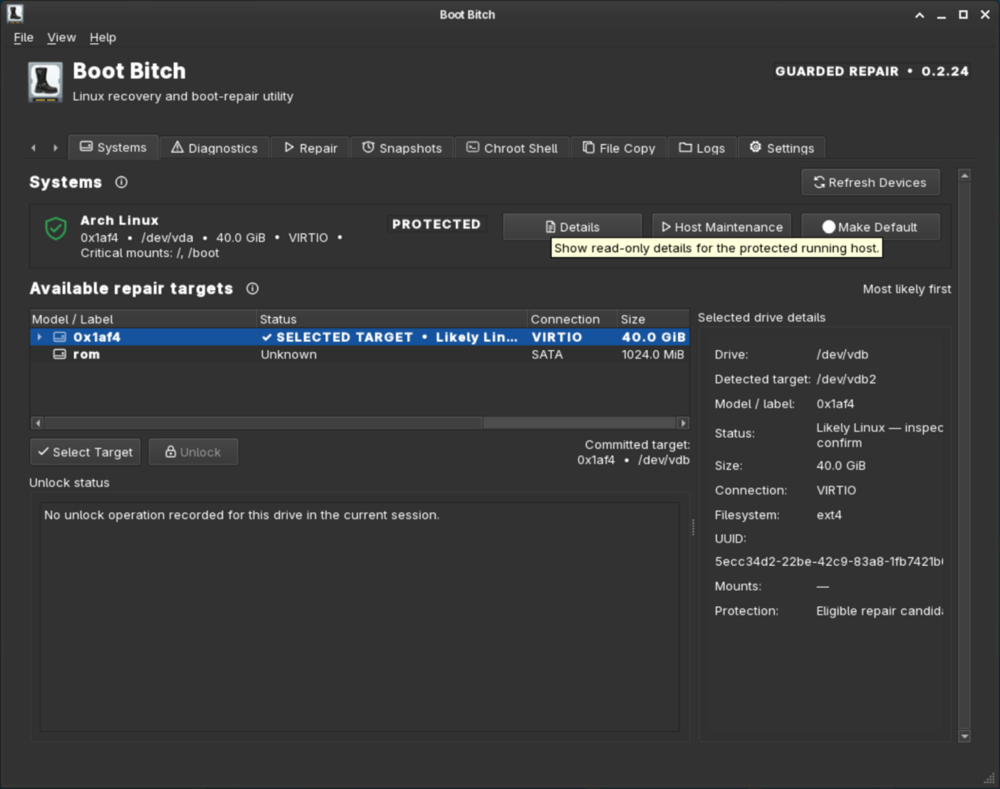
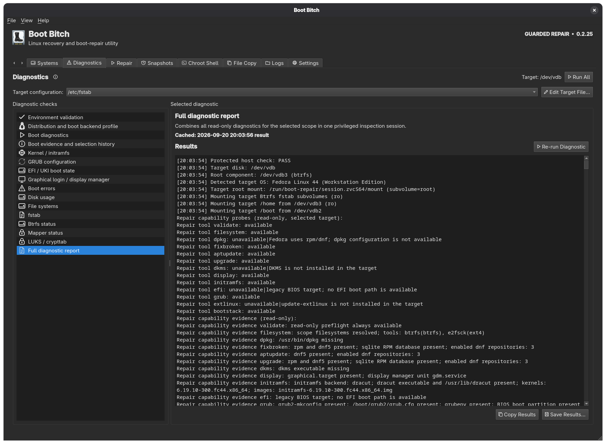
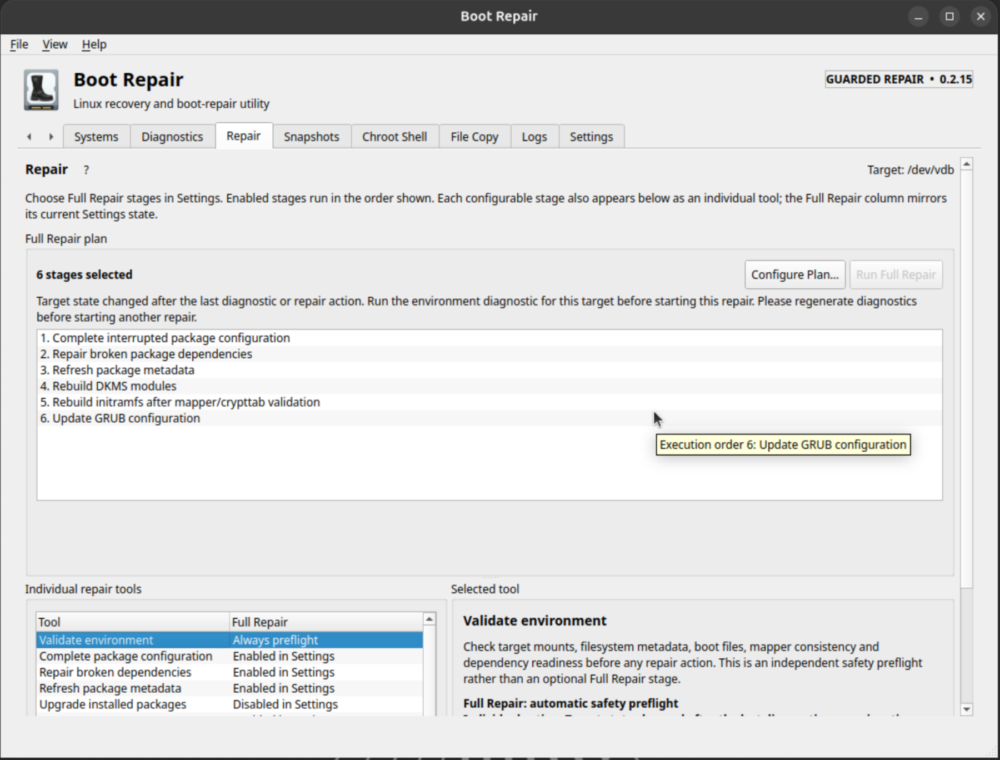
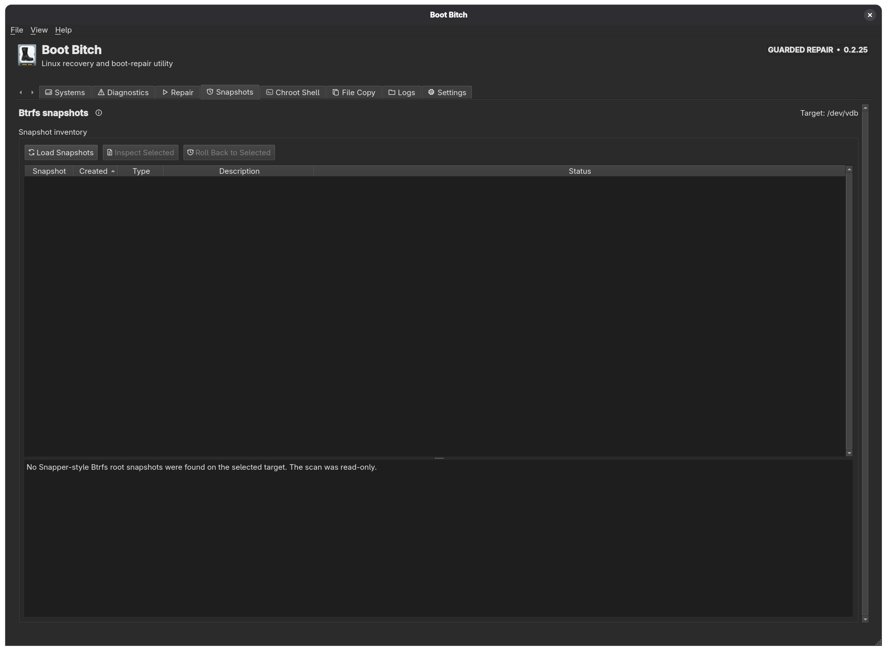
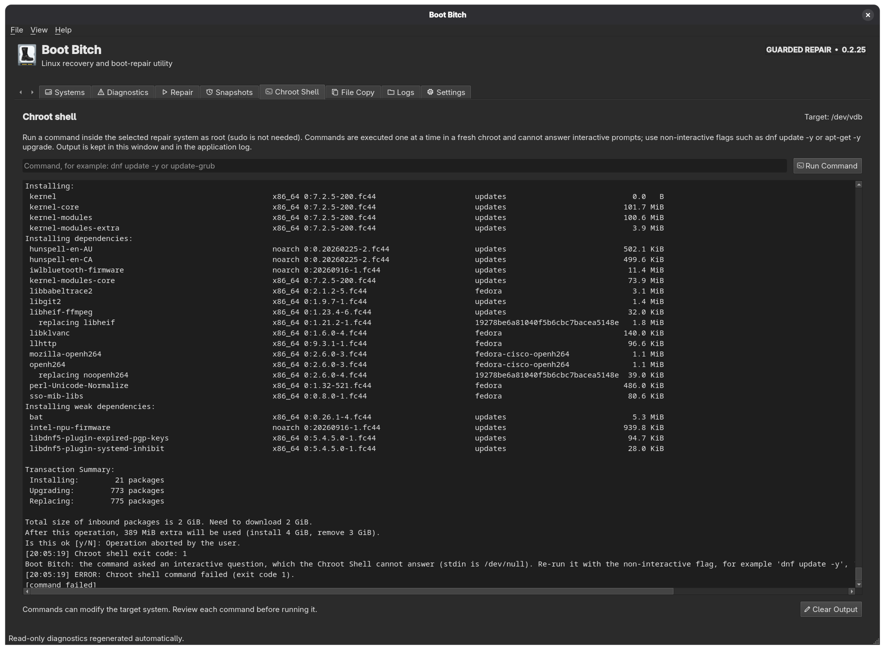
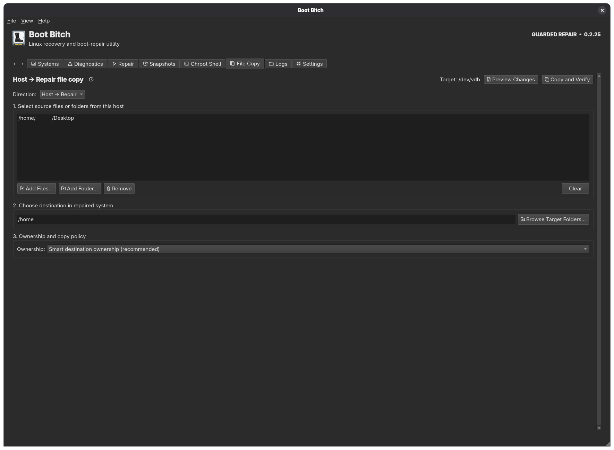
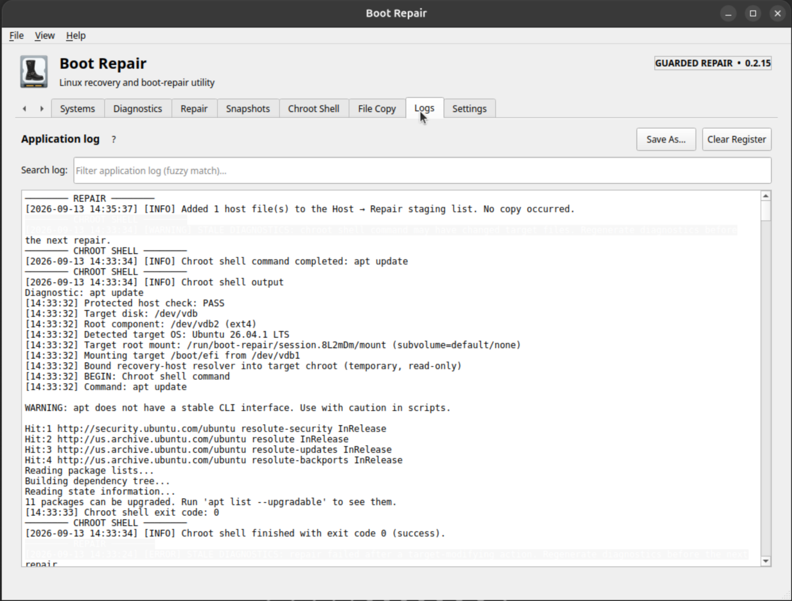
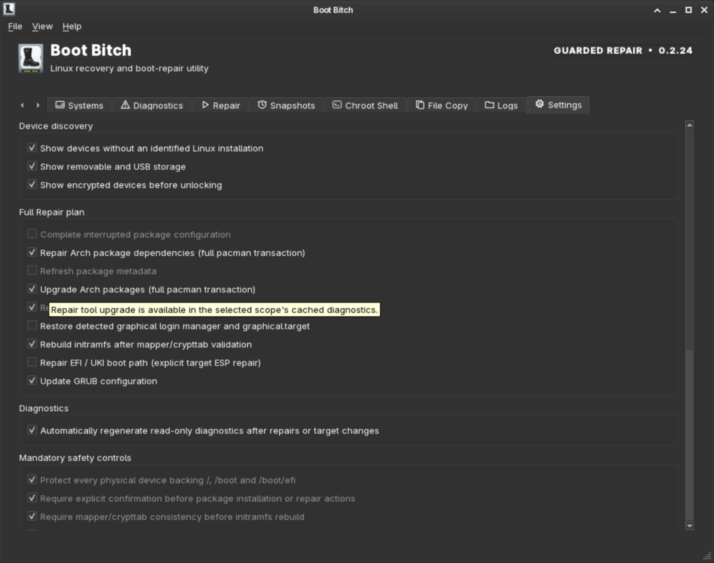

# Boot Bitch 0.2.25 — maintenance release

Boot Bitch is a native Qt 6 Linux recovery utility. The application command and Debian package retain the stable technical name `boot-repair` for compatibility; the source repository is `Boot_Bitch`. Version 0.2.25 includes the guarded diagnostics cache, simulation-first repair stack, Btrfs snapshot recovery, audited chroot shell, verified file copy, responsive Qt interface, and native RPM/APK artifacts with Alpine, Arch and Fedora repair backends. Each repair layer performs the strongest practical read-only or trial preflight available, applies only recognized deterministic corrections, and stops on unknown failures instead of guessing. The application was written to address the lack of coherent tooling that lets a non-developer restore a system so it can boot after something goes wrong. Common boot issues can be addressed directly, while the diagnostics, chroot shell and file-copy workflows also support troubleshooting and manual fixes.

This project was written with LLM assistance under human guidance, requirements and manually verified tests.

**Developer:** CaptainMorgan12

## Supported systems

Boot Bitch must be launched from a **different booted Linux environment for ordinary repair-target work**: a Linux live USB, recovery stick, or another Linux installation on a different physical drive. The running host can also be selected explicitly as a guarded Host Maintenance target. The GUI needs a Qt 6.4+ desktop. Repair backends are selected from read-only probe evidence, never from the distribution name:

- **Debian / Ubuntu / TUXEDO and derivatives** — APT/dpkg package repair, initramfs-tools, DKMS, GRUB, TUXEDO UKI and EFI/UKI recovery.
- **Arch-family** — sandboxed pacman transactions, mkinitcpio, conventional GRUB/EFI and systemd-boot/UKI layouts.
- **Fedora / RHEL and openSUSE / SUSE** (0.2.25) — guarded DNF5/RPM package transactions, dracut initramfs with `lsinitrd` verification, GRUB2 configuration and boot-code repair, and the systemd GDM display path.
- **Alpine** (0.2.25) — `apk fix`/`apk upgrade` transactions, mkinitfs initramfs, config-only extlinux regeneration, OpenRC display-manager restore and guarded UEFI GRUB repair.

Host Maintenance runs the supported stages natively on the active Debian/Ubuntu, Arch or Alpine system. EFI/UKI stages remain Debian/Arch-only, and unknown boot layouts are refused instead of guessed.

## Install

Download the artifact for your system from the GitHub release page and verify it against the attached `SHA256SUMS`:

| System | Artifact | Install |
| --- | --- | --- |
| Debian/Ubuntu/TUXEDO | `boot-repair_0.2.25_amd64.deb` | `sudo apt install ./boot-repair_0.2.25_amd64.deb` |
| Arch | `boot-bitch-0.2.25-x86_64.pkg.tar.zst` | `sudo pacman -U boot-bitch-0.2.25-x86_64.pkg.tar.zst` |
| Fedora/RHEL | `boot-bitch-0.2.25.x86_64.rpm` | `sudo dnf install ./boot-bitch-0.2.25.x86_64.rpm` |
| openSUSE/SUSE | `boot-bitch-0.2.25.x86_64.rpm` | `sudo zypper install ./boot-bitch-0.2.25.x86_64.rpm` |
| Alpine | `boot-bitch-0.2.25.apk` | `sudo apk add --allow-untrusted ./boot-bitch-0.2.25.apk` |
| Any Linux desktop | `boot-repair_0.2.25_x86_64.AppImage` | `chmod +x boot-repair_0.2.25_x86_64.AppImage && ./boot-repair_0.2.25_x86_64.AppImage` |

The native packages install the GUI, bundled icons, desktop metadata, the manual page, the EFI label helper and the privileged helper at `/usr/libexec/boot-repair/boot-repair-helper`. Privileged actions are authorized through Polkit/`pkexec` and use the host's runtime tools (`mount`, `cryptsetup`, `btrfs`, `efibootmgr`, and the selected distribution's boot and package tools); install the tools needed for the repair you intend to run.

Launch the installed command as `boot-repair`. On GNOME, install the optional `qt6-gtk-platformtheme` and `qt6-xdgdesktopportal-platformtheme` packages for GTK-like controls and native file dialogs; KDE uses its normal Qt platform theme. The AppImage uses the same privilege boundary and is intended for portable use, not as a replacement for the native package; it bundles the SVG icon engine and the desktop integration (Qt platform themes and widget styles) present on its build host, so the release AppImage is built on a Debian-family desktop (see [Build packages](#build-packages)). File dialogs inside the AppImage use Qt's own implementation because the KIO/GTK worker and portal services the native dialogs rely on are not bundled; installed builds keep their desktop's native dialogs.

`./scripts/install.sh` detects the host package family and installs a locally built `.deb`, RPM, Arch package or APK after an explicit `INSTALL` confirmation. `./scripts/install.sh --source` installs a staged CMake build under `/usr/local` (or another absolute `PREFIX`), and `./scripts/uninstall.sh` removes a detected native package or the source install after an explicit `UNINSTALL` confirmation.

## Build from source

### Dependencies

Required:

- C++17 compiler (GCC or Clang)
- CMake 3.20+
- Ninja
- Qt 6.4+ Core/Gui/Widgets development files (the CI suite builds against Ubuntu's Qt 6.4)

Runtime and packaging support used by guarded repair builds:

- Polkit / `pkexec`; util-linux (`lsblk`, `findmnt`, `blkid`, mount tools)
- `rsync` and `cryptsetup` for verified file copy and LUKS unlock
- systemd `systemctl` for graphical-target and display-manager repair
- `efibootmgr` for guarded UEFI entry/order inspection
- binutils `objcopy` for TUXEDO UKI verification; Python 3 for guarded EFI label updates
- file system check tools (for example `e2fsprogs`, `dosfstools`, `btrfs-progs`, `xfsprogs`) for the read-only-first file system repair engine
- Debian packaging tools for `.deb`, `rpmbuild` for RPM, `makepkg` for Arch, `abuild` for APK, and CPack's TGZ generator for the package-manager-neutral archive
- KDE Frameworks 6 KAuth development files remain optional

`./scripts/setup-dev-deps.sh` installs the build/runtime set for the detected package manager (APT/dpkg, pacman, DNF/RPM, zypper/RPM or apk), and `./scripts/check-dev-env.sh` inspects the environment without installing anything. The Debian/Ubuntu/TUXEDO command is:

```bash
sudo apt update && sudo apt install --no-install-recommends -y \
    build-essential cmake ninja-build pkg-config \
    qt6-base-dev qt6-base-dev-tools extra-cmake-modules \
    dpkg-dev desktop-file-utils lintian \
    pkexec util-linux mount rsync cryptsetup btrfs-progs systemd \
    efibootmgr binutils python3 lvm2 mdadm
```

### One-command Release build

```bash
./scripts/build.sh
```

This performs a clean Release build, validates an isolated staged install and writes the artifacts under `build-release/`. On Debian-family build hosts it also creates the `.deb`; when `linuxdeploy`/`appimagetool` are available it creates the versioned AppImage with its `.zsync` update metadata, so Gear Lever/AppImageUpdate can detect new GitHub releases. Nothing is installed.

```bash
./build-release/boot-repair                   # run the build directly
./scripts/test-deb.sh build-release/*.deb     # validate without installing
```

### Manual build

```bash
cmake -S . -B build -G Ninja -DCMAKE_BUILD_TYPE=Release
cmake --build build -j"$(nproc)"
./build/boot-repair
```

A standard source install uses `-DCMAKE_INSTALL_PREFIX=/usr/local` (or another prefix) followed by `sudo cmake --install build`. KF6Auth is discovered directly with `find_package(KF6Auth QUIET NO_MODULE)`, so distributions do not need an umbrella `KF6Config.cmake`.

### Build packages

Each packaging script stages a Release build and creates the artifact without installing it; the generated path is printed and can be redirected with `BUILD_DIR`:

```bash
./scripts/package-deb.sh       # Debian package
./scripts/package-arch.sh      # native Arch package (makepkg)
./scripts/package-rpm.sh       # RPM (CPack/rpmbuild)
./scripts/package-alpine.sh    # signed APK (abuild, Alpine build user)
./scripts/package-tarball.sh   # package-manager-neutral TGZ
./scripts/build-appimage.sh    # AppImage + .zsync under build-release/
```

Build the release AppImage on a Debian-family desktop (the reference host is
TUXEDO OS) with `qt6-svg-plugins`, `plasma-integration`,
`qt6-gtk-platformtheme` and `qgnomeplatform-qt6` installed: `linuxdeploy` can
only bundle the Qt SVG icon engine and the platform themes/widget styles the
build host provides, so widget styling matches the desktop only when the
AppImage is built there. File dialogs stay Qt's own inside the AppImage (the
native dialogs need worker/portal services the image does not carry) while
installed builds keep the desktop's native dialogs. `scripts/build-appimage.sh`
and `scripts/build.sh` print a non-fatal warning on other hosts and when no
platform theme was bundled, and `DEPLOY_PLATFORM_THEMES=0` opts out of theme
bundling.

The AppImage build probes the payload for the `.relr.dyn` relocations current
distributions emit and picks safe fallbacks automatically: a system `patchelf`
0.18 or newer when available, no stripping when the bundled strip cannot read
the section, and self-extracting AppImage mode when FUSE is unavailable. This
lets Arch, Fedora, Alpine and current Debian-family hosts build a working
AppImage; the build stops with installation instructions only when no
RELR-capable `patchelf` exists. `PATCHELF`, `NO_STRIP` and
`APPIMAGE_EXTRACT_AND_RUN` override the detection.

Validate generated packages without installing them:

```bash
./scripts/test-deb.sh
./scripts/test-rpm.sh
./scripts/test-apk.sh
```

## Testing

Configure a Release build and run the test suite:

```bash
cmake -S . -B build -G Ninja -DCMAKE_BUILD_TYPE=Release
cmake --build build -j"$(nproc)"
QT_QPA_PLATFORM=offscreen ctest --test-dir build --output-on-failure
```

The tests cover the MainWindow workflow plus the chroot-shell, display-manager, filesystem-repair, host-snapshot, icon-atlas, backend-profile and EFI-label contracts; `ctest -L fast` runs the quick tier. CI additionally runs `bash -n scripts/*.sh` and `appstreamcli validate --no-net` on the AppStream metadata. The package validation scripts (`test-deb.sh`, `test-rpm.sh`, `test-apk.sh`) inspect metadata, dependencies and the installed file set of a built artifact without installing it.

## Safety model

- Boot Bitch runs as the normal desktop user. Privileged work is isolated in a whitelisted helper behind Polkit/`pkexec`; one authorization per scope is reused until the session is locked or the application exits.
- Ordinary repair-target actions refuse the running host. The top-level devices backing `/`, `/boot` and `/boot/efi` stay protected, and Host Maintenance must be selected explicitly, repeating host identity and mount checks.
- Every repair layer runs the strongest practical read-only or simulation preflight first and applies only recognized deterministic corrections; unknown failures stop the stage instead of guessing.
- Every modifying operation requires an explicit GUI confirmation, and diagnostics are cached per scope and invalidated by writes.
- LUKS passphrases are sent to the helper over standard input only, never in command arguments or logs.
- File copy uses `rsync -aHAX --numeric-ids` without `--delete`, validates containment and ownership, and verifies the result.
- Btrfs rollback keeps the source snapshot unchanged, preserves the previous root as `@rollback-before-*`, and restores it automatically when critical post-switch validation fails.
- Missing optional runtime tools disable only the related feature; host tools are never installed silently.

Still intentionally constrained in 0.2.25:

- automatic/implicit EFI-loader reinstall: EFI repair remains an explicit action or opt-in Full Repair stage;
- transactional rollback is limited to Btrfs layouts with a normal top-level `@` root and Snapper-style root snapshots; running-host rollback additionally requires a Snapper root configuration, no `subvolid=` pin, no separate `/boot` and no other nested `@` child subvolumes, and only migrates a nested `@/.snapshots` child subvolume; unsupported layouts are refused rather than guessed;
- unsupported package-manager operations on Arch (such as standalone APT/dpkg stages), unknown boot layouts, and package transactions whose preflight reports repository errors, removals or unresolved dependencies; these remain hard-gated.

## Using Boot Bitch

- **Systems** — shows the protected running host separately from ranked repair drives; select a physical target (and unlock LUKS when needed) before any repair work.
- **Diagnostics** — read-only reports for the Running Host or the selected repair drive, including boot state, firmware entries and file systems.
- **Repair** — the configurable Full Repair plan and individual tools (file system repair, package configuration, broken dependencies, metadata refresh, adaptive package upgrade, DKMS, display manager, initramfs, EFI/UKI and GRUB), or Host Maintenance on the active system.
- **Snapshots** — read-only Btrfs/Snapper inventory and the guarded rollback workflow, including running-host rollback with a persistent **Reboot required** reminder.
- **Chroot Shell** — one confirmed root command at a time inside the selected repair system.
- **File Copy** — guarded Host → Repair and Repair → Host transfers with preview and verification.
- **Logs / Settings** — per-session logs with section filters, and the repair plan, safety rules and capability report.

## Screenshots

These anonymized screenshots show Boot Bitch running in a disposable recovery VM. The target is a separate virtual disk; personal host paths and physical-device identifiers have been removed.

### Systems



### Diagnostics



### Repair



### Snapshots



### Chroot Shell



### File Copy



### Logs



### Settings



## 0.2.25 refinements

Adds native RPM and APK release artifacts and the Alpine, Arch and Fedora
repair backends; see the [0.2.25 release notes](docs/release-notes-0.2.25.md).

- Add native RPM and APK release artifacts: `scripts/package-rpm.sh` builds
  the CPack RPM with family-specific dependency names and the POSIX `/bin/sh`
  `scripts/rpm-postinst.sh` scriptlet, and `scripts/package-alpine.sh` builds
  the signed `boot-bitch-<version>-r0.apk` with abuild and runs the project
  tests in its `check()` phase; `scripts/test-rpm.sh` and
  `scripts/test-apk.sh` validate both artifacts (metadata, dependencies,
  signature, installed file set) without installing them.
- Add a Fedora/RPM-family repair backend from the same read-only probe
  evidence as the other families: guarded dnf5 package transactions (`rpm -Va`
  + `dnf reinstall` fix-broken, a `dnf makecache` metadata stage, one
  simulated `dnf upgrade`), dracut initramfs rebuilds with kernel/image
  pairing and `lsinitrd` verification, GRUB2 configuration regeneration
  (`grub2-mkconfig --no-grubenv-update` with BLS and menuentry preservation)
  plus a guarded GRUB2 boot-code reinstall on BIOS, boot-stack reconciliation
  over dracut + GRUB2, and the systemd GDM display path
  (`/etc/gdm/custom.conf`). Journald logging and the 13 capability keys are
  unchanged; every Fedora label and gate derives from probe evidence, never
  from the distribution ID.
- Add an Alpine/apk repair backend alongside Debian/APT and Arch/pacman:
  read-only profile and capability evidence, simulation-first `apk fix` and
  `apk upgrade` transactions, and targeted missing-package-file repair driven
  by `apk audit --system` plus `apk info --who-owns`. The new `extlinux`
  capability key gates the Alpine extlinux stage; `mkinitfs` initramfs
  rebuilds, config-only `update-extlinux` regeneration with entry preservation
  and rollback, and OpenRC display-manager runlevel restore that never starts
  a graphical session inside the target chroot complete the stage set. Alpine
  Host Maintenance uses the same guards through the running apk/OpenRC, and
  EFI/UKI stages remain Debian/Arch-only.
- Add transaction-specific Arch repair preflights and guarded apply paths for
  full pacman package transactions, mkinitcpio, conventional GRUB and EFI;
  conventional EFI repair restores one verified vendor-loader firmware entry
  when a guarded grub-install leaves only files on the ESP, and individual
  mirror retrieval failures are warnings when the sandboxed transaction still
  succeeds while repository, signature, integrity, dependency, removal and
  transaction errors remain fatal. The read-only distribution and boot backend
  profiler detects Debian/APT and Arch/pacman families separately alongside
  the initramfs generator, GRUB/systemd-boot/UKI layout, ESP mount and kernel
  naming evidence, with a backend-profile contract test and portable
  kernel/initramfs pairing diagnostics; every repair tool and Full Repair
  stage is gated on read-only per-tool capability evidence (`Repair tool
  <key>: available|unavailable|<reason>`), unavailable actions disable with
  their reason (for example DKMS on a system without it, or dpkg/standalone
  APT metadata on Arch), helper runtime preflights stay mandatory, and Arch
  probes require pacman configuration/database, a detected display manager,
  installed kernel module directories and a resolvable ESP where those stages
  need them.
- Add running-host Btrfs snapshot rollback to Host Maintenance: the Snapshots
  tab lists Snapper root snapshots and Boot Bitch `@rollback-before-*` undo
  points through the new `host-snapshots` helper command and stages the
  name-preserving transaction (preserve the running `@`, promote a writable
  copy, migrate a nested `@/.snapshots` child subvolume, reconcile
  initramfs/UKI/GRUB in a scratch chroot, automatically restore on failure)
  while reporting `Host snapshot rollback` capability evidence without adding
  a 14th `Repair tool` key. A successful rollback persists a **Reboot
  required** reminder, cleared by kernel boot-id reconciliation, with `Reboot
  Now` offered only after a second explicit confirmation through the new
  `host-reboot` command; rollback never reboots automatically and is limited
  to Snapper top-level `@` roots with no `subvolid=` pin, no separate `/boot`
  and no other nested `@` child subvolumes.
- Add a read-only-first file system repair engine: diagnostics resolve the
  root, `/boot`, ESP and `/home` filesystems for the selected scope (repair
  target or running host) with their UUIDs and run the matching read-only
  check (`e2fsck -n`, `xfs_repair -n`, `btrfs check --readonly`, `fsck.fat
  -n`, `fsck.exfat -n`, `ntfsfix -n`, `jfs_fsck -n`, `reiserfsck --check`,
  `zpool status`) without writing. Only when a check reports issues does the
  tool offer repair: per-device modes are limited to what is valid for the
  mounted state (offline tools refuse mounted filesystems while btrfs and
  zpool scrub stay online), every repair requires explicit confirmation,
  dangerous modes such as `btrfs check --repair` carry an extra warning, and
  each helper invocation and its per-tool exit classification is logged. The
  new `filesystem`-gated "File system repair" tool/stage runs first in the
  Full Repair plan.
- Logging, diagnostics and UI/UX: each launch starts a fresh session log with
  scope markers, visible timestamps, prior-session viewing, clear/add-note
  actions and automatic retention (20 files or 10 MB); stale read-only
  diagnostics regenerate automatically after invalidating operations once a
  privileged session exists (affected sections only, or the union once at the
  end of Full Repair, and repairs that changed nothing keep the cache valid),
  Run All stays asynchronous with the capability block emitted once and
  repeated sections updated in place, journal evidence is filtered to system
  boot components with near-identical lines collapsed, and log rendering is
  coalesced and incremental with colored ✓/✗/▪ result summaries and
  action-accurate verbs. The UI adds a global busy indicator; one
  authorization request per scope with a visible Authorize action after
  cancellation (the separate LUKS prompt is unchanged); a guarded running-host
  Host Shell through the new `host-shell` command with firmware write
  isolation, also fixing the Host Maintenance shell crash; `@section` log
  search with section filters and a wider Individual Repair Tools pane;
  deterministic responsive repair-target rows (`DeviceStatusDelegate`); and
  narrow-window Systems, Logs, File Copy and Repair layouts with one-fifth
  splitter minimums, scroll edge shadows and the bundled monochrome
  kernel/initramfs/GRUB/distribution icons.
- Fixes and tooling: an idle PackageKit daemon no longer blocks host package
  repairs; vendor apt release-metadata changes warn and retry once with
  `Acquire::AllowReleaseInfoChange` while other apt errors and all package
  transactions stay strict; real Polkit/pkexec authorization failures are
  surfaced and logged; the initramfs generator is detected from installed
  packages with the TUXEDO UKI builder required for that EFI layout; the
  conventional GRUB EFI repair no longer lets the efibootmgr same-label
  warning pollute the captured firmware ID and fails closed on a missing or
  invalid mapping; a failed Full Repair plan marks only the failing stage and
  reports stages that never ran as "not run"; internal cleanups change no
  behavior. Dependency setup and installation are package-manager aware
  (APT/dpkg, pacman, DNF/RPM and zypper/RPM) with native Arch, RPM and
  package-manager-neutral TGZ workflows while `.deb` generation stays
  Debian-family; AppStream ships eight remote screenshots, the current release
  entry, a `<pkgname>` association and no deprecated `developer_name`, with
  hicolor icon-cache refreshes, the Discover stock-icon workaround and the
  `/usr/local` icon-cache cleanup on uninstall; file system check tools are
  declared package dependencies; and the native Arch, Alpine and Fedora
  packages are validated with `scripts/test-rpm.sh`, `scripts/test-apk.sh` and
  `scripts/test-deb.sh` without installing them.

## 0.2.24 refinements

Adds the semantic icon atlas, the read-only-first file system repair engine,
Arch host-maintenance package repair and the distribution/boot backend
profiler; see the [0.2.24 release notes](docs/release-notes-0.2.24.md).

- Bundle the semantic icon atlas as the deterministic UI source across desktop
  themes and add the Qt SVG runtime dependency required on Arch and other
  minimal installations.
- Add the read-only-first File system repair tool and Full Repair stage
  (ordered first): resolve the root, `/boot`, ESP and `/home` filesystems with
  their UUIDs, run the matching read-only check, and offer per-device repair
  modes only after issues are found and the user confirms; offline tools
  refuse mounted filesystems while btrfs/zpool scrub stay online.
- Add Arch host-maintenance package repair and upgrade stages through
  transaction-specific preflights and guarded full pacman transactions;
  standalone APT/dpkg stages remain unavailable on Arch.
- Add the read-only distribution/boot backend profiler, backend-profile
  contract test and kernel/initramfs pairing diagnostics; gate every repair
  tool and Full Repair stage on the scope's read-only diagnostics (DKMS, APT
  metadata and Arch prerequisites disable with a reason while helper
  preflights remain).
- UI/UX polish: busy indicator; one authorization request per scope; journal
  evidence filtered to boot components; section-scoped diagnostics refresh
  with coalesced incremental rendering; narrow-window Logs/File Copy; guarded
  Host Shell with the host-maintenance crash fix; single Polkit prompt on Host
  Maintenance entry; `@section` log search and section filters; responsive
  Repair/Systems layouts; scroll edge shadows; one-fifth splitter minimums;
  Systems page and Host Maintenance details fit; compact snapshot rows; and
  software-center metadata with six screenshots, the installed size, package
  association and icon-cache refreshes.
- Fixes: same-labelled GRUB EFI entries no longer pollute the captured
  firmware ID and a failed plan attributes each stage correctly; an idle
  PackageKit daemon no longer blocks host package repairs; the initramfs
  generator is detected from installed packages; apt release-metadata changes
  warn and retry once; no-op pacman transactions report unchanged; repair
  summaries are action-accurate with durable ✓/✗/▪ glyphs; diagnostics
  regeneration is evidence-driven and Run All no longer duplicates log
  sections; stale `/usr/local` source installs are removed on uninstall; the
  Debian/TUXEDO GRUB preflight inspects an isolated `grub-mkconfig` output;
  the protected-host shield/check returns as a bundled green status icon;
  file-system check tools are declared package dependencies (common tools
  hard, the rest recommended/optional); code-review cleanups with no behavior
  change.

## 0.2.23 refinements

Adds guarded running-host maintenance, repair-system folder browsing and
verified EFI destination and label maintenance; see the
[0.2.23 release notes](docs/release-notes-0.2.23.md).

- Maintain one canonical UKI, firmware fallback and WebFAI destination per
  maintained ESP, remove safely identified duplicates, and group retained
  firmware entries in BootOrder by drive and normal use (UKI/vendor loader
  before fallback and WebFAI); update existing descriptions only through a
  validated EFI_LOAD_OPTION rewrite with read-back.
- Record the detected UKI/GRUB boot chain and root-LUKS handoff in boot
  evidence so repairs preserve the expected single unlock path.
- UI/docs: keep the repaired-system folder browser's navigation and
  confirmation rows visible at compact sizes, annotate maintained entries with
  the drive model without duplicating model text, and clarify EFI behavior,
  icon fallbacks and Running Host versus selected-repair support.

## 0.2.22 refinements

- Fix Host → Repair destination browsing to decode directory records
  correctly, and make the repaired-system browser compact by default, freely
  resizable and usable at small window sizes.

## 0.2.21 refinements

- Protect multi-disk EFI state during TUXEDO UKI and conventional GRUB
  rebuilds: isolate vendor delete/create calls, classify every firmware entry,
  restore entries by stable PARTUUID/label/loader identity, preserve relative
  order, reconcile BootOrder/BootNext and refuse vendor-specific paths rather
  than guessing; restore a missing running-host TUXEDO UKI registration and
  annotate only the selected ESP's labels.
- Extend read-only diagnostics and guarded repairs to the explicitly selected
  Running Host, guard GRUB regeneration against dropping existing menu entries
  (reject and roll back), and make Host → Repair destination browsing use
  temporary read-only target mounts so the repair tree cannot be confused with
  the host's folders.

## 0.2.20 refinements

- Bundle the semantic Qt/KDE icon atlas for tabs, diagnostics, repair stages
  and actions, preferring a usable host theme or freedesktop aliases before
  the bundled artwork and native high-contrast fallbacks; add filesystem-aware
  device icons and reject solid theme placeholders so controls remain readable
  on incomplete host themes.

## 0.2.19 refinements

- Add CaptainMorgan12 attribution to the About dialog, AppStream metadata,
  Debian package metadata and copyright files, and add a Qt-aware AppImage
  build workflow with optional linuxdeploy Qt bundling.
- UI polish: keep GNOME/GTK snapshot rows compact and improve dark-theme icon
  contrast, including terminal and disabled-stage icons.

## 0.2.18 refinements

- UI/CI polish: compact GNOME/GTK table rows that grow only when wrapped, dark
  theme glyph tinting with colored status artwork preserved, and
  `actions/checkout@v5` for Node.js 24 runners.

## 0.2.17 refinements

- Packaging/theme docs: optional GNOME/GTK Qt platform-theme, XDG portal and
  GNOME Qt theme suggestions, with environment-driven GNOME theme selection
  documented while KDE keeps its native Plasma style.

## 0.2.16 refinements

- Fix compact snapshot-row sizing on Qt 6.4/Ubuntu CI, install `pkexec` in the
  GitHub Actions test environment so repair-readiness UI checks run with the
  capability present, tolerate a lost executable bit on source-tree helpers by
  invoking readable shell helpers through `/bin/bash`, and revalidate the UI,
  Chroot Shell, display-manager, package, desktop-entry and AppStream checks.

## 0.2.15 refinements

- First official GitHub release: a guarded Qt 6 recovery workflow for
  selecting targets, unlocking LUKS, inspecting boot state and applying
  supported repairs, with authoritative per-target diagnostic caching (stale
  evidence on edits, writes, shell, rollback and copies) and simulation-first
  package, DKMS, initramfs, GRUB, EFI/UKI and boot-stack paths that stop on
  unknown or unsafe failures.
- Evidence-based graphical-login repair (SDDM, GDM3, LightDM, greetd, ly,
  custom systemd managers) and guarded transactional Btrfs/Snapper rollback
  with automatic restoration on critical reconciliation failure.
- Feature set and packaging: Chroot Shell, guarded bidirectional File Copy,
  persistent categorized Logs, asynchronous snapshot loading, target
  configuration editors, protected ESP/firmware handling, KDE/Freedesktop and
  AppStream metadata, the `boot-repair(1)` manual page, and UI,
  helper-contract and staged Debian-package validation tests.

## Pre-release development notes (0.2.14 and earlier)

Versions 0.2.14 and earlier were development iterations before the first
public release. Their detailed history is retained in [CHANGELOG.md](CHANGELOG.md);
they are not presented as public GitHub releases.

## License

Boot Bitch is released under the MIT License. See `LICENSE`.
